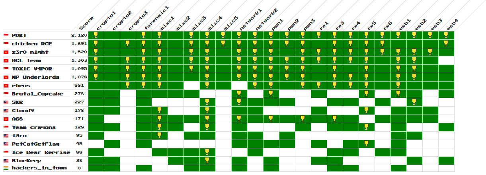

# HITBxWargames.MY GSEC Singapore 2019

#### *Date*

```text
Start Event: 29/08/2019 10:00 AM
End Event: 30/08/2019 04:00 PM 
```

#### *Rules*

```text
We try hard to keep the competition as free and exciting as possible; however, we do require teams to adhere to a few simple rules:

1. Show up in time or you'll miss the briefing.
2. No off-the-shelf automated scanning tools such as Nessus, OpenVAS, etc. It's useless and we'll kick you out for that lame ass shit.
3. No cooperation between teams with independent accounts. Sharing of flags or providing revealing hints to other teams is cheating, don't do it.
4. No attacking the competition infrastructure. If bugs or vulns are found, please alert the competition organizers immediately
5. Absolutely no sabotaging of other competing teams, or in any way hindering their independent progress.
6. No brute forcing of challenge flag / keys against the scoring server
7. No flooding and / or DoS attacks. Teams caught in the act will be penalized by a time penalty or a disqualification.
8. No ARP spoofing. Teams caught in the act will be penalized by a time penalty or a disqualification.
9. No physical attacks against other players.
10. All participants must obey to PIT STOP calls. PIT STOP calls are rest intervals where all the players must leave the CTF area to facilitate for the CTF Crew to perform maintenance work.
10. The rules and regulations will or might be updated without prior notice.
11. At all times, the decision of the HITB and WGMY Crew is final on any matter in question.


Rules might be updated from time to time, without prior notice.
```

#### *Scoring*

```text
We do adaptive scoring based on the number of solves. All challenges start out at 500 and decrease from there.

The 500pts will be equally distributed among teams solved that particular challenge.
```

#### *Hint*

```text
Any hints will be distributed as announcements.

No hints will be given once a challenge is solved.
```

#### *Write-up*

#### *Final Scoreboard*


